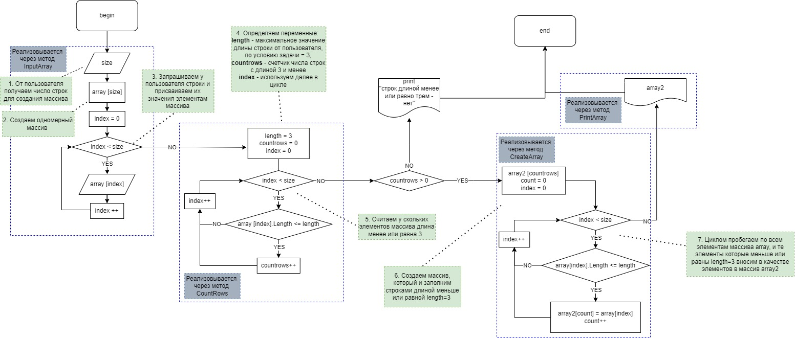

# ЗАДАЧА:
Написать программу, которая из имеющегося массива строк формирует новый массив из строк, длина которых меньше, либо равна 3 символам. Первоначальный массив можно ввести с клавиатуры, либо задать на старте выполнения алгоритма. При решении не рекомендуется пользоваться коллекциями, лучше обойтись исключительно массивами.

**Примеры:**

[“Hello”, “2”, “world”, “:-)”] → [“2”, “:-)”]
[“1234”, “1567”, “-2”, “computer science”] → [“-2”]
[“Russia”, “Denmark”, “Kazan”] → []

# РЕШЕНИЕ ЗАДАЧИ:
Далее нумерация пунктов соответствует нумерации в комментариях на блок-схеме.

## ИСПОЛЬЗУМЫЕ МЕТОДЫ:
При решении задачи будут созданы и использованы следующие методы:

## 1. Метод "InputArray ()"
Метод получения данных от пользователя с клавиатуры и заполнения ими одномерного массива:

1. Запрашивается у пользователя число строк, которые он будет далее вводить (число *size*).
2. Создается одномерный массив с числом элементов *size* (тип элементов - *string*), предназначенный для заполнения строками пользователя.
3. Через цикл запрашиваем у пользователя строки и вносим их значения в качестве элементов в массив, созданный в п.2.

Метод возвращет заполненный строками пользователя одномерный массив (тип элементов - *string*).

## 2. Метод "CountRows ()"

Метод подсчета числа элементов в массиве, длина которых менее или равна заданному значению в условии задачи.

На вход метод принимает одномерный массив (массив *array*, тип элементов - *string*).

4. Определяем новую переменную *countrows* равной 0 (нулю), *countrows* будет выступать в качестве счетчика элементов в массиве (тип элементов - *string*), чья длина менее или равна заданному значению в условии задачи. Также определяем новую переменную *length* равной 3 (трем), *length* выступает в качестве значения максимальной длины строк, которые нам нужно отобрать и вывести в массив.
5. Через цикл, перебирая все элементы одномерного массива *array*, метод ведет подсчет числа элементов, чья длина менее или равна значению переменной *length* = 3. 

Метод возвращет значение переменной *countrows*.

## 3. Метод CreateArray ()
Метод создания нового массива и его заполнения элементами, чья длина удовлетворяет условию задачи.

На вход метод принимает одномерный массив (массив *array*, тип элементов - *string*) и переменную *length* (тип - *int*), которая фактически равна будет значению максимальной длины элементов для отбора - 3 (трем).

6. Создается новый одномерный массив (массив *array2*, тип элементов - *string*) с числом элементов *countrows*, предназначенный для заполнения строками пользователя, чья длина меньше или равнам *length* = 3. Напомню, значение *countrows* получаем с помощью метода "CountRows ()".
7. Через цикл, перебирая все элементы одномерного массива *array*, отбираем те элементы, длина которых менее или равна значению переменной *length* = 3, и вносим их в наш новый созданный массив - *array2* (создали его в п.6).

Метод возвращет массив *array2*, заполненный только теми строками пользователя, которые удовлетворяют условию задачи - их длина меньше или равна *length* = 3.

## 4. Метод PrintArray ()
Метод, печатающий массив в строку в формате, заданном условием задачи

## СОБСТВЕННО САМО РЕШЕНИЕ:
- Создаем новый массив *array* и заполняем его элементами, используя метод InputArray (). Число элементов *array* соответствуеь числу, введенному пользотвалем, а его элементы - это строки, который пользователь также ввел.

- Определяем переменную *length* = 3, что соответствует условию задачи - отобрать строки с длиной меньше или равной 3 (трем).

- Определяем переменную *countrows* через метод CountRows (). Фактически она равно числу строк пользователя, чья длина меньше или равна *length* = 3.

- Проверояем условие - есть ли вообще строки, удовлетворяющие условию задачи? Если таких строк нет, то выводим сообщение, что строки, удовлетворяющие условию задачи, отсутстуют. Работа алгоритма/программы ЗАВЕРШЕНА.

- Если перменная *countrows* > 0 (т.е. строки, удовлетворяющие условию задачи, присутствуют), то создаем новый массив *array2* и заполняем его строками пользователя, чья длина меньше или равна *length* = 3. Для этого испольузем метод CreateArray ().

- Используя метод PrintArray () выводим в терминал массив *array2* в формате, заданном условием задачи. Работа алгоритма/программы ЗАВЕРШЕНА.

# БЛОК СХЕМА АЛГОРИТМА:
В этом разделе добавлена блок-схема алгоритма решения задачи.

Нумерация комментариев на блок-схеме соответствует нумерации пунктов в разделе "Используемые методы" в описании выше

